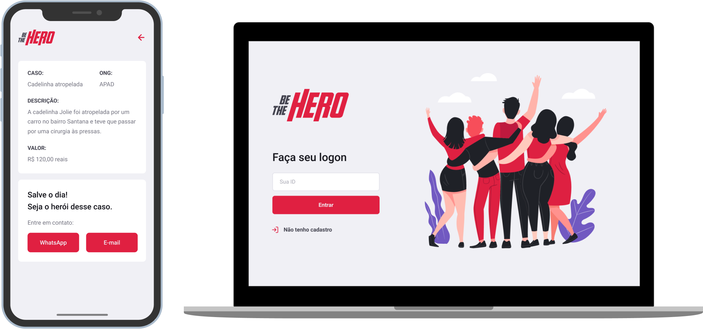

<h1 align="center">
    
</h1>

<h4 align="center">
  🚀 Projeto desenvolvido durante a Semana OmniStack 11.0, evento promovido pela Rocketseat
</h4>

  <a href="#rocket-tecnologias">Tecnologias</a>&nbsp;&nbsp;&nbsp;|&nbsp;&nbsp;&nbsp;
  <a href="#-projeto">Projeto</a>&nbsp;&nbsp;&nbsp;|&nbsp;&nbsp;&nbsp;
  <a href="#-layout">Layout</a>&nbsp;&nbsp;&nbsp;

 

  

## :rocket: Tecnologias

Esse projeto foi desenvolvido com as seguintes tecnologias:

- [Node.js](https://nodejs.org/en/)
- [React](https://reactjs.org)
- [React Native](https://facebook.github.io/react-native/)
- [Expo](https://expo.io/)

## 💻 Projeto

O Be The Hero é um projeto que visa conectar pessoas que desejam fazer contribuições monetárias a ONG's (Organizações não governamentais) que necessitam de ajuda.

## 🔖 Layout

Você pode visualizar o layout do projeto através [desse link](frontend-be-the-hero/git-files/Figma-be-the-hero.fig). Lembrando que você irá precisar ter uma conta no [Figma](http://figma.com/).

---

Desenvolvido por Yves Guilherme 🚀
